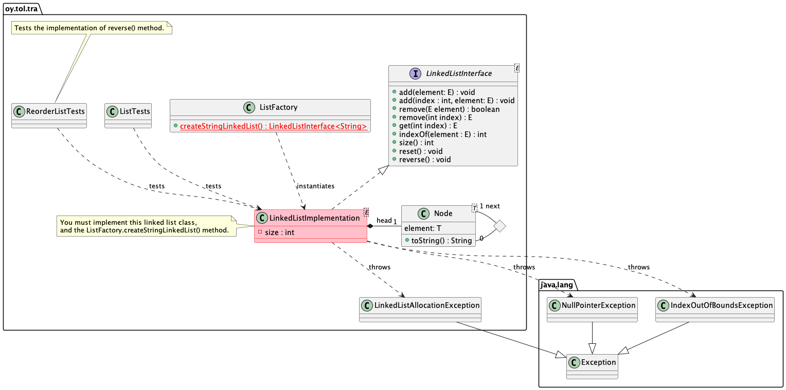

# Linked list exercise

Data structures and algorithms.

## The goal of task 1

> **NOTE** For the 99.99% of us, this exercise *requires* using pencil and paper to **design before implementing** the data structure. So use them, and *first* design how the various algorithms should work, and only then implement them. In most cases, *not* using pencil and paper leads to overly complicated and failing implementations. This may be hard to believe, but this is a fact.

If you already haven't started to **use the debugger** to diagnose and solve problems, do that now.

* The goal of this exercise task is to implement a Linked list data structure.
* The implementation must pass all the tests included in the `ListTests.java`.
* After your implementation of linked list passes the tests, continue to the task 2.

Note that this file describes the first task of the exercise, and **another readme**, `TASK-2.md` describes the second. First follow instructions here, only then go ahead to the [TASK-2.md](TASK-2.md).

The linked list implemented here will be a **singly-linked** list. List only has links to next element, not previous. Also only `head` node is implemented, no need to maintain a `tail` node.

Note also that the `size()` and `clear()` methods of your implementation must be O(1) algorithms.

## Prerequisites

You have all the tools installed and working. This was tested in the `00-init` exercise  of the course. If you haven't done that yet, do it now. Hopefully you have already done the stack and queue exercise before entering this one.

## Instructions

The UML class diagram below shows an overview of the classes in this exercise.



You should **implement** the interface `LinkedListInterface` in your own class. The `LinkedListImplementation.java` is already there for you. Implement the methods so that the tests in the `ListTests.java` pass. Do not yet try to execute the `ReorderListTests.java` tests, that is the job in the 2nd task.

Make sure to **read** the `LinkedListInterface` documentation **carefully** so that your implementation follows the interface documentation. Obviously you need to know how linked lists work in general, so **check out** the course lectures and other material on linked list data structures.

Note also that the list implementation already has a `Node` class for you. `Node` is a helper class that defines the list structure. `Node` has a `next` element, also a `Node`. The `Node` contains the `element`, the actual data held in the linked list. You do not need to change or add the `Node` implementation, just use it.

After you have implemented your linked list methods, **instantiate** it in the `ListFactory.createStringLinkedList()`. After this, you are ready to test your implementation.

A note on syntax. Remember how to use generic classes in Java (from Programming 2 course). So this is the way to use them, syntactically correct way:

```Java
MyGenericClass<String> anObject = new MyGenericClass<>();
```

Note the way the diamond symbol `<>` is used and where to place the template parameter (String in this example). Do not forget to use the diamond symbol -- otherwise the code will have warnings. Your code should follow the principle of "zero errors, zero warnings".

In your linked list, **implement** also the method `String toString()` inherited from the  `Object` class:

```Java
@Override
public String toString() {
   ...
```

The returned string includes the contents of the list, from the head onwards, *exactly* in the following format, including commas and spaces:

```text
[110, 119, 121]
```

This example linked list was created by calling `list.add(110)`, `list.add(119)` and `list.add(121)`. An empty list must return the string "[]". Note that the list may contain *any* types of Java objects, in addition to Integers!

## Testing

**Run the ListTests tests** to make sure your linked list implementation passes the unit tests. From command line, you can  execute the tests (in the directory that contains the exercise `pom.xml` file):

```terminal
mvn -Dtest=ListTests test
```

If the tests do not pass, you will see errors. Otherwise you will see that the tests succeed. If you have issues, fix your linked list implementation and try again.

Course demonstrations show how to execute the tests from Visual Studio Code. Note that at this point you need only to execute the tests in `ListTests.java`.

When working with this exercise, **do not**:

* Change the `LinkedListInterface` class in anyway.
* Change the unit tests in anyway.

Your linked list interface implementation java file is the only file you need to edit in this exercise.

## Delivery

Do not deliver this exercise for evaluation until you have completed the second task of this exercise, described in the [TASK-2.md](TASK-2.md).

## Questions or problems?

Participate in the course lectures, exercises and online support group.

## About

* Course material for Data structures and algorithms 2024.
* Study Program for Information Processing Science, University of Oulu.
