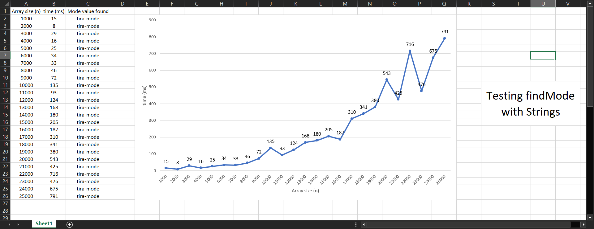
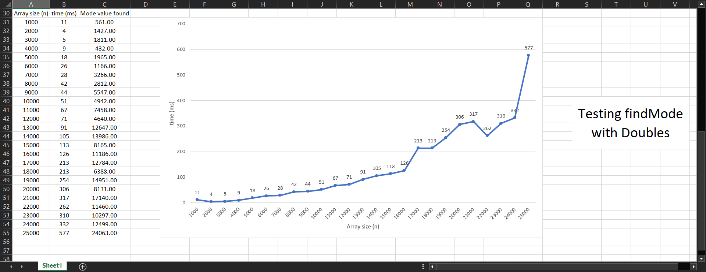
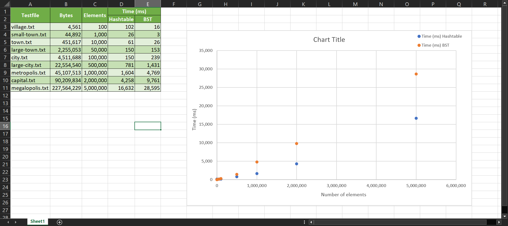

# Learnings from the course tasks and reports

Write a couple of sentences per task, what did you learn from the task, how did you manage to do it.

If a task asks you to **report** something, do write the report in this document.

## 00-init

## 01-arrays

## 02-mode

There is a report related to this task. Write that here!

Generally, the larger the sample size, the longer it takes for the code to run.
Time complexity: O(n*log(n))

## 03-draw

## 04-1-stack

## 04-2-queue

## 04-3-linkedlist

## 05-binsearch

## 05-invoices

## 67-phonebook

There is a report related to this task. Write that here!

1. The function used to calculate the hashes is `Math.abs(key.hashCode()) % buckets.length`: taking the `hashCode()` of the key and then taking its modulo which is the length of the dictionary, and finally applying absolute value to avoid negative index.
1. The fill factor used when reallocating the array is 0.75.
1. The reallocation process grows the hash table size by 2 times. It is the least integer to maintain the array's integral length after very step.
1. The maximum depth for all the files under BST implementation is 56.
1. For the `getStatus()` functions respectively, the total number of buckets, non-empty buckets, collisions and reallocated times are tracked in Hashtable, and height, balance factor, max/min/avg depth for BST. One good thing is that the reallocation times stays relatively small even with large sample sizes for Hashtable, and the same goes for maximum depth for BST.
1. The sorting method used in `67-phonebook` is still QuickSort, but way more optimized than in `05-invoices`. The same goes for the `partitionByRule` method.

## Optional tasks

If you did any optional tasks, list them here so that teachers will check them out and grade them!

# Feedback section

General feedback and costructive development ideas for the course, please!